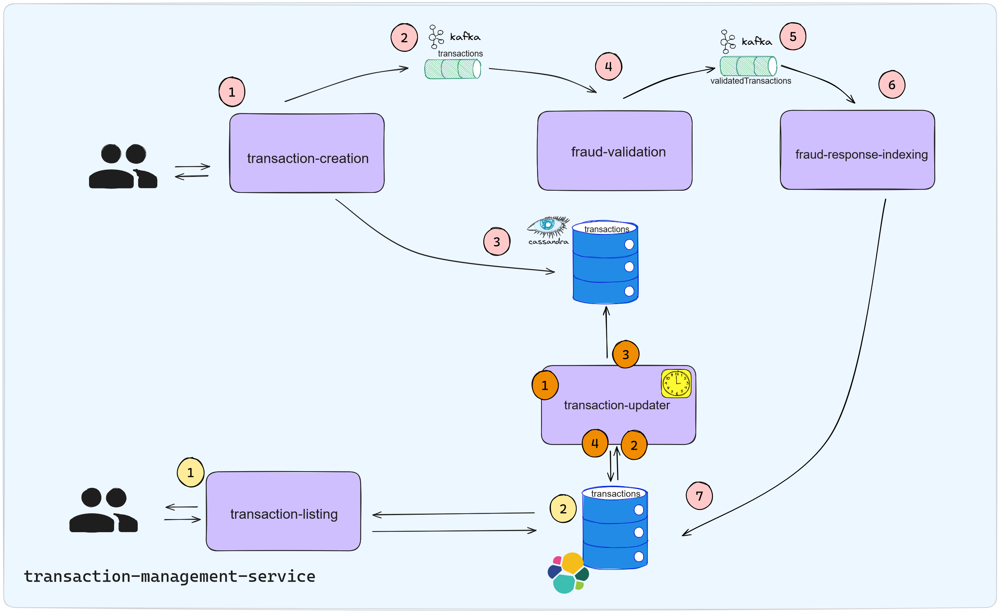

# transaction-management-service



### Existen 3 flujos principales en esta arquitectura basada en microservicios y eventos.

### A) Flujo Rosa
1. Inicia cuando el cliente hace una solicitud, la cual es recibida por el servicio de creación de transacciones.
2. Este servicio publica un evento en un tema de Kafka.
3. Registra esta transacción en la base de datos Cassandra.
4. Este evento es consumido por el servicio de validación de fraude.
5. El servicio de validación de fraude publica su veredicto en otro tema de Kafka.
6. Este veredicto es consumido por el servicio de indexación de respuestas de fraude.
7. El servicio de indexación de respuestas de fraude inserta el veredicto en la base de datos Elasticsearch.

### B) Flujo Amarillo
1. El cliente inicia una solicitud para listar transacciones.
2. El servicio de listado de transacciones procesa la solicitud y lee la información de la base de datos Elasticsearch, devolviendo la respuesta al cliente.

### C) Flujo Naranja
1. Este flujo es orquestado por un servicio que se ejecuta de manera programada.
2. El servicio inicia el flujo buscando en la base de datos Elasticsearch todas las transacciones que deben ser actualizadas.
3. Actualiza estas transacciones en la base de datos Cassandra para mantener sincronizada la información.
4. Elimina el marcador en la base de datos Elasticsearch que indica que esta transacción ya fue actualizada.

# Guía de Configuración del Servicio de Gestión de Transacciones

Este repositorio contiene un sistema integral de gestión de transacciones. El sistema puede crear transacciones, validarlas a través de un servicio de detección de fraude y las disponibiliza para ser consultadas.

Aquí te presentamos los pasos para levantar el servicio de gestión de transacciones:

## 1.Preparación

##### NOTA:Asegurate de posicionarte en la raiz del proyecto para ejecutar cada uno de estos comandos

## 2.Levantamiento de Infraestructura

 Ejecuta el siguiente comando para levantar los servicios de Kafka, Elasticsearch y Cassandra:

```bash
docker-compose -f docker-compose-infra.yml up -d
```

## 3.Configuración de Cassandra

Para configurar Cassandra, ejecuta los siguientes comandos en la raíz del proyecto:

- Copia y ejecuta el script de creación de la tabla principal:

```bash
docker cp create_table.cql cassandra:/tmp/create_table.cql
```

```bash
docker exec -it cassandra cqlsh -f /tmp/create_table.cql
```

- Copia y ejecuta el script de creación de la tabla paramétrica:

```bash
docker cp table_parametrica.cql cassandra:/tmp/table_parametrica.cql
```
```bash
docker exec -it cassandra cqlsh -f /tmp/table_parametrica.cql
```

## 4.Configuración de Kafka

Para configurar Kafka, ejecuta los siguientes comandos en la raíz del proyecto:

- Copia el script de creación de temas al contenedor:

```bash
docker cp create-topics.sh kafka:/tmp/create-topics.sh
```

- Otorga permisos de ejecución al script:

```bash
docker exec -u root kafka chmod +x /tmp/create-topics.sh
```

- Ejecuta el script dentro del contenedor:

```bash
docker exec -it kafka /tmp/create-topics.sh
```

## 5.Levantamiento de Microservicios

Tienes dos opciones para levantar los microservicios:

### Opción A: Usar Imágenes de Docker Hub

Si las imágenes de tus servicios ya están disponibles en Docker Hub, puedes omitir los pasos de compilación y construcción de imágenes y levantar los servicios directamente con Docker Compose:

- Ejecuta el siguiente comando:

```bash
docker-compose -f docker-compose-apps-hub.yml up -d
```

Asegúrate de que las etiquetas de las imágenes en el archivo `docker-compose-apps-hub.yml` coincidan con las de las imágenes que subiste a Docker Hub.

### Opción B: Compilar el Proyecto y Construir las Imágenes Docker

Si prefieres compilar el proyecto y construir las imágenes Docker localmente, sigue estos pasos:

1. Asegúrate de tener configurado Java 11 en tu entorno. Puedes verificarlo ejecutando `java -version` en tu terminal.

2. Navega a la raíz del proyecto y ejecuta `mvn clean install` para compilar el proyecto.

3. Construye las imágenes Docker para cada servicio con los siguientes comandos:


```bash
docker build -t fraud-response-indexing ./fraud-response-indexing
docker build -t fraud-validation ./fraud-validation
docker build -t transaction-creation ./transaction-creation
docker build -t transaction-listing ./transaction-listing
docker build -t transaction-updater ./transaction-updater
```

4. Levanta los servicios con Docker Compose ejecutando el siguiente comando:
##### NOTA:Asegurate de posicionarte en la raiz del proyecto para ejecutar este comando.


```bash
docker-compose -f docker-compose-apps.yml up -d
```

Con estos pasos, tendras en funcionamiento el servicio de gestión de transacciones.